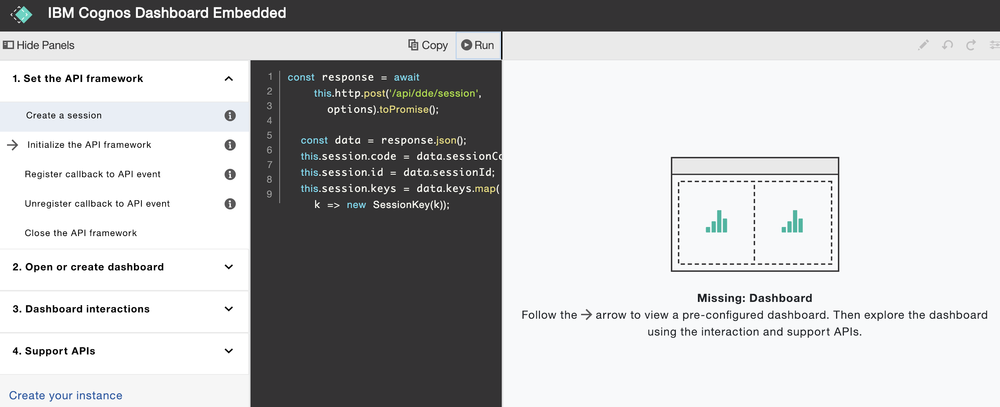

---

copyright:
  years: 2019
lastupdated: "2019-04-11"

keywords: getting started, session, creating session, service credential

subcollection: cognos-dashboard-embedded

---

{:new_window: target="_blank"}
{:shortdesc: .shortdesc}
{:screen: .screen}
{:codeblock: .codeblock}
{:pre: .pre}

# Getting started tutorial {{site.data.keyword.dynamdashbemb_short}}
{: #gettingstartedtutorial}

## Step 1: Provisioning a {{site.data.keyword.dynamdashbemb_short}} service instance
{: #step1}

You can create one or more instances of the {{site.data.keyword.dynamdashbemb_short}} service.

**Note:**  The Lite pricing plan is unrestricted.  When the {{site.data.keyword.dynamdashbemb_short}} service becomes generally available, quotas will be enforced for the entire account. Creating additional Lite plans will share the same quota.

To see your GUID, use the following Bluemix command in the command line interface (CLI):  

```bash
bx account list
```    
{: pre}

To create a {{site.data.keyword.dynamdashbemb_short}} service instance, do the following steps:

1. In your web browser, go to https://cloud.ibm.com/.
1. Login to your {{site.data.keyword.cloud}} account, or create an account.
1. Navigate to the {{site.data.keyword.cloud}} catalog: https://console.bluemix.net/catalog/.
1. In the section **Data & Analytics**, click the {{site.data.keyword.dynamdashbemb_short}} tile.
1. On the {{site.data.keyword.dynamdashbemb_short}} catalog page, specify the following:
  1. Specify a name for the new {{site.data.keyword.dynamdashbemb_short}} service instance.
  1. Choose a region.
  1. Choose a resource group.
  1. Choose the **Lite** planning price.
  1. Click **Create**.

The {{site.data.keyword.dynamdashbemb_short}} service instance page displays once the service instance is created. This page allows you to access the Getting Started documentation, create credentials, and view or change your plan settings.

For billing and security purposes, you can create multiple instances.

## Step 2: Creating a service credential
{: #step2}

You use a service credential to programmatically access the service from your application. The service credential includes the URL to access the service instance and the credentials to access the service. It may be desirable to create multiple service credentials for different applications or deployments of your applications. You cannot restore removed credentials. You'll have to create new credentials for your application.

1. On the left side, click **Service credentials** and click **New credential**. Then, do the following steps:
	1. In the **Name** field, you specify the name of the credential. This should represent the name of the application that will be accessing the service.
	1. Optionally select an Access role and Service ID. 
    **Note:** The IAM role is currently not used to access the {{site.data.keyword.dynamdashbemb_short}} service.
	1. Click **Add**.
2. On the **Service Credentials screen**, click **View credentials** on the name of the credential that you created in the previous step. A JSON object is displayed which includes credential details.

You will use the following values to create a session and embed {{site.data.keyword.dynamdashbemb_short}} into your application:
  - api_endpoint_url
  - client_id
  - client_secret
    
## Step 3: Creating a {{site.data.keyword.dynamdashbemb_short}} session
{: #step3}

You can use a REST service to create a {{site.data.keyword.dynamdashbemb_short}} session with basic authentication using the *client_id* and *client_secret*. Store and handle these credentials securely as you would any other password. Use credentials only from a server application.  

Request Example:
```bash
curl -X POST "https://dde-us-south.analytics.ibm.com/daas/v1/session" -H "accept: application/json" -H  "authorization: Basic <base64 client_id:client_secret>" -H  "Content-Type: application/json" -d "{  \"expiresIn\": 3600,  \"webDomain\": \"https://dde-us-south.analytics.ibm.com\"}"
```    
{: pre}

Response Example:
```bash
{
  "sessionId": "SN401234567801933ccccf",
  "sessionCode": "CDfc21234567875e06a",
  "keys": [
    {
      "kty": "RSA",
      "e": "AQAB",
      "use": "enc",
      "kid": "58110ceb123456787f417e6298",
      "alg": "RSA",
      "n": "AJG6QxPXGdn...clipped"
    }
  ]
}
```    
{: pre}

Use the *sessionCode* value to create and initialize the {{site.data.keyword.dynamdashbemb_short}} session.

**Note:** The *sessionCode* expires after 60 seconds.

The *keys* object values can be used by the server application while the server application encrypts the credentials when it builds the dashboard specification. Do not use the keys directly within the browser application. 

When you use the Swagger documentation to test the {{site.data.keyword.dynamdashbemb_short}} REST API, enter the *client_id*  in the **Username** field and the *client_secret* in the **Password** field when you authorize the Swagger client using basic authentication. You can find the Swagger documentation for REST API here: https://dde-us-south.analytics.ibm.com/api-docs/.

See the following example screen capture:


## Step 4: Embedding {{site.data.keyword.dynamdashbemb_short}} through the JavaScript API
{: #step4}

With {{site.data.keyword.dynamdashbemb_short}}, you can embed dashboards into a web application using the JavaScript API. The documentation of the API is located here: https://dde-us-south.analytics.ibm.com/daas/jsdoc/cognos/api/CognosApi.html.

**Note:** Specify the web-domain of your application that contains the {{site.data.keyword.dynamdashbemb_short}} dashboard, in the POST request to create the session.

Make sure that your application does the following:
- Pull in the CognosApi.js file. The CognosApi.js file is available from the {{site.data.keyword.dynamdashbemb_short}} service instance: https://dde-us-south.analytics.ibm.com/daas/CognosApi.js.
- Create and initialize an instance of the API framework. This API takes three parameters:
  1. The *cognosRootURL*, which is the api_endpoint_url from the credentials created in step 2.
  2. The *sessionCode*, which is the same as the sessionCode created in step 3.
  3. The document object model (DOM) node. This is where the dashboard is embedded into your client application.
  
If the initialization call fails and you get an error like "Refused to display <your IBM URL> in a frame because an ancestor violates the following Content Security Policy directive: frame-ancestors.", then this might be the result of not specifying the sub-domain of your application when you create the session.
    
After you created an instance of the dashboard, you can either create a new dashboard or open a previously authored dashboard by passing in the dashboard specification.

You can interact with embedded dashboard in various ways through the dashboard API. Some examples include:
-	Add data sources to the dashboard.
-	Undo and redo actions.
-	Show and hide the properties pane.
-	Register for events.
-	Get the dashboard specifications. You can then persist this specification, and use it later in the openDashboard() method.

As an application developer, you can explore this API with the {{site.data.keyword.dynamdashbemb_short}} demo application:
https://ibm-cognos-dashboard-demo.ng.bluemix.net/.



As a starting point a demonstration project is available on GitHub: https://github.com/IBM/cognos-dashboard-demo.

## Step 5: Working with a {{site.data.keyword.dynamdashbemb_short}}
{: #step5}

{{site.data.keyword.dynamdashbemb_full}} uses the powerful IBM Cognos Analytics dashboard experience. To learn more above the Cognos Analytics dashboard experience, please see [IBM Cognos Analytics - Dashboard documentation](https://www.ibm.com/support/knowledgecenter/en/SSEP7J_11.0.0/com.ibm.swg.ba.cognos.ug_ca_dshb.doc/wa_dashboard_discoveryset_intro.html){: new_window}.


